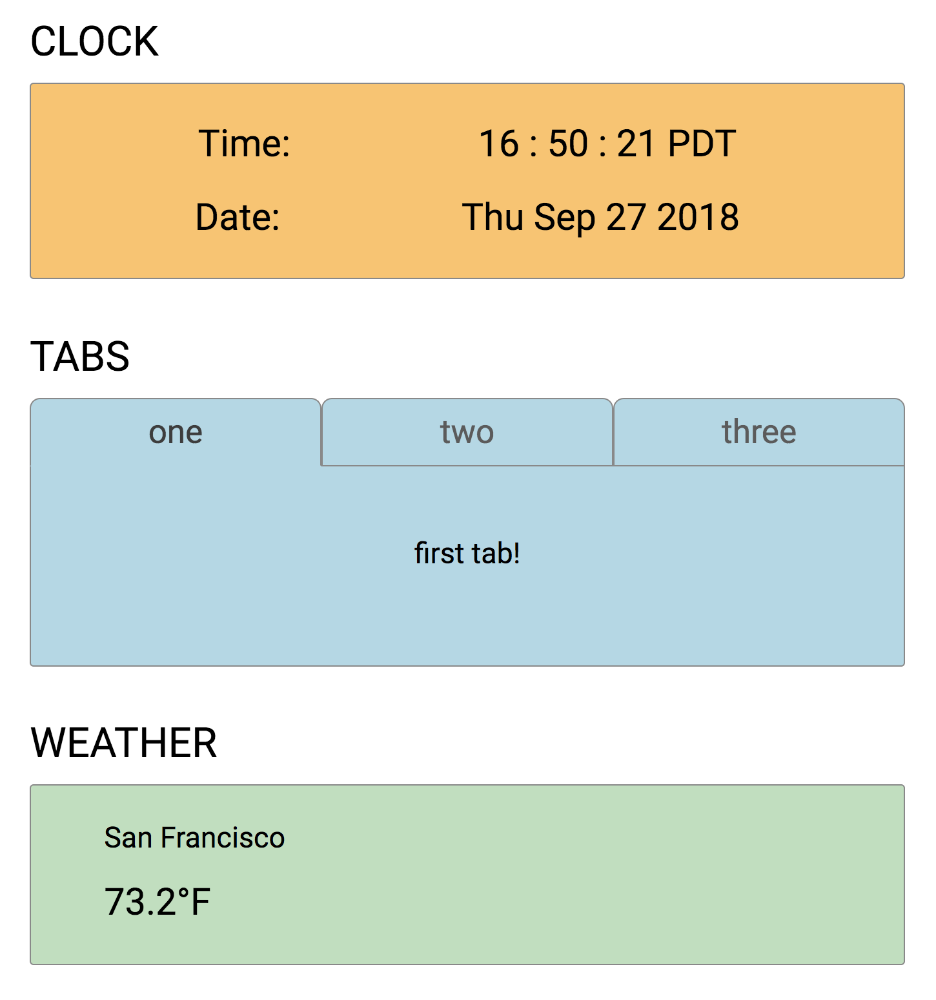

# 🙃 Widgets

## Technologies
- React (JavaScript)
- Webpack
- HTML5/CSS3
- Open Weather API

## Features
- Widgets
  1. Live-updating clock
  2. One where users can switch between tabs
  3. Weather data that changes depending on the user's location
